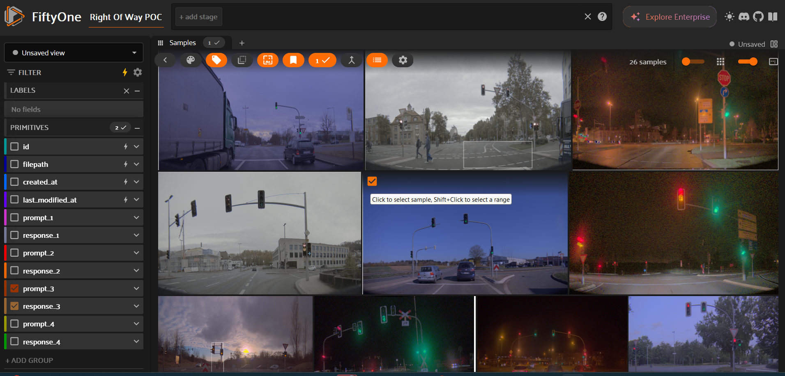
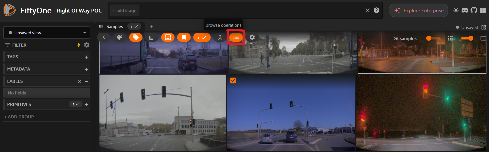
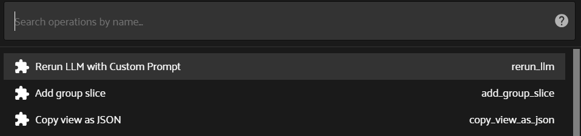
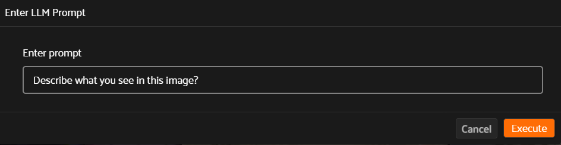
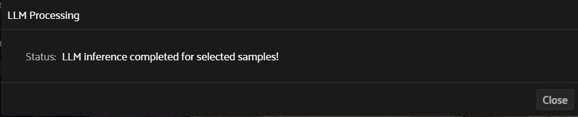
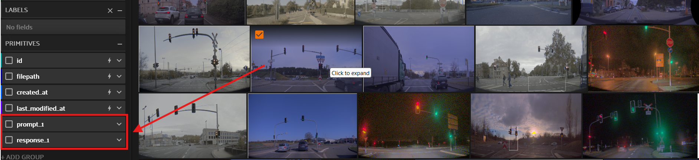
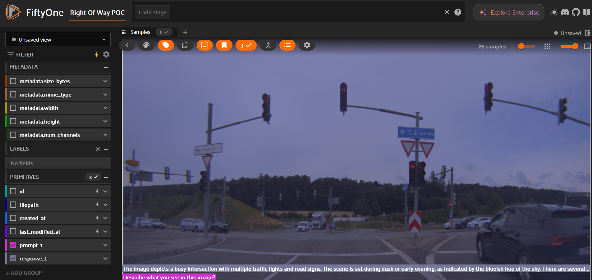

## Setup and Installation
Move to the src/voxel_prompt_engineering directory and run the following commands:

1. Install requirements: `pip install -r src/voxel_prompt_engineering/requirements.txt`
2. Configure image path in voxel.py script to the path containing your images

A custom fiftyone plugins directory is specified for voxel to recognize our plugin:
- Run the following command: `export FIFTYONE_PLUGINS_DIR={PATH_TO voxel_prompt_engineering_dir}`

We use a FastAPI application which provides an endpoint for running inference on images using the Qwen2-VL-2B-Instruct and Deepseek-vl2-tiny model with vLLM. The API accepts a base64-encoded image along with a text prompt and returns the generated response.

## Usage

Start the inference server by running the following command in the **voxel_prompt_engineering directory** :

- Run server: `python3 vllm_inference_server.py --model qwen/deepseek`

- Run voxel_visualization: 'python3 voxel.py'

## Plugin Usage

After starting the voxel session, it will be available on http://localhost:5151
- To use the plugin, first select the sample/samples you want to run it on:

- Next click on the Browse Operations button:

- Select the Rerun LLM operator

- Enter the custom prompt you would like to use and click on Execute.

- After execution, you will see a status message

- After inference, new Primitives containing the prompt and response will be added to the dataset in the Primitives section. If it is not visible, reload the browser.

- Click on the newly added primitives to view them:

- Now you can see the prompt and response for the selected samples

You can use the plugin with multiple samples at the same time. In the first step, select as many samples as you would like to use.

You can swap between deepseek and qwen by using the run time argument --model when running the vllm_inference_server.py script